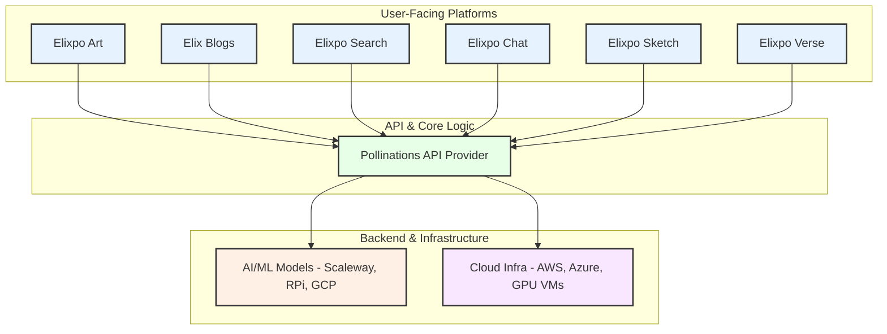

# Elixpo — A Developer-First Open Source Series
## Enhanced Learning and Intelligence Process Optimization ##

### Welcome to Elixpo-Chapter, an Open Source Repository (OSR) begun in 2023 as a college initiative, this open-source series has grown into a collaborative ecosystem of open source projects and collaborative development. In just two years, we've built over 17 projects, engaged a global community, and participated in numerous hackathons and open-source programs.

### **💖 If you believe in open and accessible projects, please leave a ⭐ on the repository!**

---

## 🚀 Our Mission & Vision

At Elixpo, we are dedicated to building a future where AI is **open, ethical, and accessible to everyone**. Our mission is to create a community-driven ecosystem where developers, creators, and enthusiasts can collaborate, learn, and innovate without barriers like paywalls or proprietary restrictions. We believe in transparency, responsible development, and the power of interconnected tools to build a better future.

### Key Features

- 🔓 **100% Open Source:** Licensed under GNU GPL-3.0 to ensure all derivatives remain open.
- 💸 **Completely Free:** All our tools and platforms are free to use, forever.
- 🤖 **AI-Powered:** From art generation to search, AI is at the core of what we do.
- 🤝 **Community-Driven:** We thrive on collaboration and welcome contributions from all.
- 🌐 **Web-Based & Embeddable:** Easily accessible through web interfaces and simple to integrate.

---

## 🎉 Join Us for Hacktoberfest 2025!

**Hacktoberfest is live!** We enthusiastically welcome contributions from developers around the world.

- **Find Issues:** We have curated issues perfect for new contributors.Look for them which is tagged with `hacktoberfest` in our [issue tracker](https://github.com/Circuit-Overtime/elixpo_chapter/issues).
- **Read the Guidelines:** Before submitting a PR, please review our [**Code of Conduct**](./CODE_OF_CONDUCT.md) and [**Contributing Guidelines**](./CONTRIBUTING.md).

Let's build something amazing together!

---

## 🛠️ Projects in the Elixpo Ecosystem

This monorepo hosts a diverse collection of projects, each with its own development track.

| Project              | Description                                                                                     | Link(s)                                                                                                                                                   |
| :------------------- | :---------------------------------------------------------------------------------------------- | :-------------------------------------------------------------------------------------------------------------------------------------------------------- |
| **Elixpo Art**       | AI art generation and enhancement platform.                                                     | [elixpo.com](https://elixpo.com), [Chrome Extension](https://chromewebstore.google.com/detail/elixpo-art-select-text-an/hcjdeknbbbllfllddkbacfgehddpnhdh) |
| **Elix Blogs**       | A modern blogging platform for tech articles and tutorials.                                     | [elixpo.com/blogs/elixpo_art](https://elixpo.com/blogs/elixpo_art)                                                                                        |
| **Elixpo Search**    | An intelligent, AI-powered search engine.                                                       | `search.elixpo`                                                                                                                                           |
| **Elixpo Chat**      | A platform for creating and interacting with AI chatbots.                                       | `chat.elixpo`                                                                                                                                             |
| **Jackey**           | A personalized Discord bot for image generation and more.                                       | [jackey.elixpo.com](https://jackey.elixpo.com)                                                                                                            |
| **Elixpo Sketch**    | A real-time, WYSIWYG collaborative canvas and editor.                                           | `sketch.elixpo`                                                                                                                                           |
| **Elixpo Verse**     | A stylish wallpaper with a live, animated clock.                                                | `verse.elixpo`                                                                                                                                            |
| **Text-Emoji**       | Text-to-emoji converter using a fine-tuned T5-Small model.                                      | [Hugging Face](https://huggingface.co/Elixpo/Emoji-Contextual-Translator)                                                                                 |
| **LlamaMedicine**    | A Llama model fine-tuned for medicine-related tasks.                                            | [Ollama](https://ollama.com/Elixpo/LlamaMedicine)                                                                                                         |
| **Pollinations UI**  | An improved user interface for the Pollinations project website.                                | `polli.elixpo`                                                                                                                                            |
| **Elixpo Portfolio** | The personal portfolio of the project founder.                                                  | `elixpo`                                                                                                                                                  |
| **Inkflow**          | A minimalist canvas developed by [**Ez-Vivek**](https://github.com/ez-vivek).                   | `inkflow`                                                                                                                                                 |
| **Fing & Fing-UI**   | A vibe-coding platform and React UI library by [**Subhro Koley**](https://github.com/IgYaHiko). | `igyahiko.fing`, `igyahiko.fing-ui`                                                                                                                                         |
| **CortexOne**        | An AI-powered desktop application built with Electron, React, and TypeScript.                   | `itachi.cortexOne`                                                                                                                                        |
| **Vision**        | An AI-powered desktop application built with Electron, React, and TypeScript.                   | `igyahiko.vision`                                                                                                                                        |
| **Memory-Arc**        | An application to use LSTM to track conversations with an NLP model.                   | `itachi.memory-arc`                                                                                                                                        |

## 👑 Key Achievements

- **`22+` Open Source Projects** successfully built and deployed.
- **`20+` Global Contributors** have shaped the Elixpo ecosystem.
- **`20+` Hackathons** participated in, fostering innovation and rapid development.
- **Featured in Major Programs** like **GSSOC**, **Pollinations.AI**, and **OSCI**.
- **Recognized by MS Startup Foundations** with funding in 2024.
- **Active Participant** in **Hacktoberfest 2024 & 2025**.

<a href="https://star-history.com/#Circuit-Overtime/elixpo_chapter&Date">
  <picture>
    <source media="(prefers-color-scheme: dark)" srcset="https://api.star-history.com/svg?repos=Circuit-Overtime/elixpo_chapter&type=Date&theme=dark" />
    <source media="(prefers-color-scheme: light)" srcset="https://api.star-history.com/svg?repos=Circuit-Overtime/elixpo_chapter&type=Date" />
    
  </picture>
</a>

---

## 🏛️ Overall Architecture

The Elixpo ecosystem is designed as a series of interconnected platforms that leverage a central API binding layer. This layer communicates with external AI/ML models and infrastructure providers to deliver powerful features across our applications.

## Development Note

Elixpo is a parallel development initiative with multiple sub-projects evolving simultaneously within this monorepo. We actively welcome external open-source projects—if you’d like your project featured here, submit a proposal! Accepted projects will be listed as contributors and included under the GNU GPL license.

> Each project follows its own dedicated development track and process, covering diverse fields across computer science. This structure encourages collaboration, innovation, and cross-disciplinary growth within the Elixpo ecosystem.

## Collaborators

We are excited to collaborate with various developers and artists in the open-source community. If you are interested in contributing, please reach out! Together, we aim to enhance the capabilities of this art generator.

## Funding

This project is funded through a mix of personal investment, community contributions, and generous infrastructure support. Our cloud compute and VPS resources are provided by [Pollinations AI](https://pollinations.ai) — special thanks to Thomas Haferlach and the Pollinations team for enabling our large-scale AI workloads.

We are actively seeking sponsors to help us grow and sustain the project. If you or your organization would like to support Elixpo, please visit our [GitHub Sponsors page](https://github.com/sponsors/Circuit-Overtime) or reach out to discuss partnership opportunities.

Your support helps us cover infrastructure costs, accelerate development, and expand our open-source initiatives. Thank you for helping us build a more accessible and collaborative AI ecosystem!

# Recent Releases

Here are some of our latest releases and live demos:

- **Elixpo Art Chrome Extension**  
  [Available on Chrome Web Store](https://chromewebstore.google.com/detail/elixpo-art-select-text-an/hcjdeknbbbllfllddkbacfgehddpnhdh?authuser=0&hl=en-GB&pli=1)  
  Easily generate AI art from selected text in your browser.

- **Elixpo Art Platform**  
  [elixpo.com](https://elixpo.com)  
  The main platform for AI-powered art generation and sharing.

- **Jackey Discord Bot**  
  [jackey.elixpo.com](https://jackey.elixpo.com)  
  A personalized Discord bot for image generation and more.

- **Fine-Tuned Llama Medicine Model**  
  [ollama.com/Elixpo/LlamaMedicine](https://ollama.com/Elixpo/LlamaMedicine)  
  Specialized Llama model fine-tuned for medicine-related tasks.

- **Emoji Translator**  
  [huggingface.co/Elixpo/Emoji-Contextual-Translator](https://huggingface.co/Elixpo/Emoji-Contextual-Translator)  
  Translate text to context-aware emojis using our custom model.

  - **Elixpo Art Blog**  
    [elixpo.com/blogs/elixpo_art](https://elixpo.com/blogs/elixpo_art)  
    In-depth articles and updates about the Elixpo Art platform.

---

# Our Future

At Elixpo_Chapter, we are dedicated to shaping a future where projects are:

- **Open & Accessible**: AI should empower everyone—free from paywalls, proprietary barriers, or exclusivity.
- **Transparent & Ethical**: We prioritize transparency in our models and workflows, ensuring ethical development and responsible use.
- **Community-Driven**: Our platform thrives on collaboration, inviting developers, creators, and enthusiasts to contribute and innovate together.
- **Interconnected**: We’re building an ecosystem where AI tools and services integrate seamlessly, enabling composable and synergistic solutions.
- **Continuously Evolving**: We embrace rapid advancements in AI, adapting and improving while upholding our core values of openness and accessibility.

Our mission is to advance AI for the benefit of all—respecting ethical standards, fostering responsible innovation, and building a collaborative community. Join us in making AI open, ethical, and impactful for everyone.

# Stargazers

  

  

> ## `Made with ❤️ by Ayushman Bhattacharya & Collabs!`
