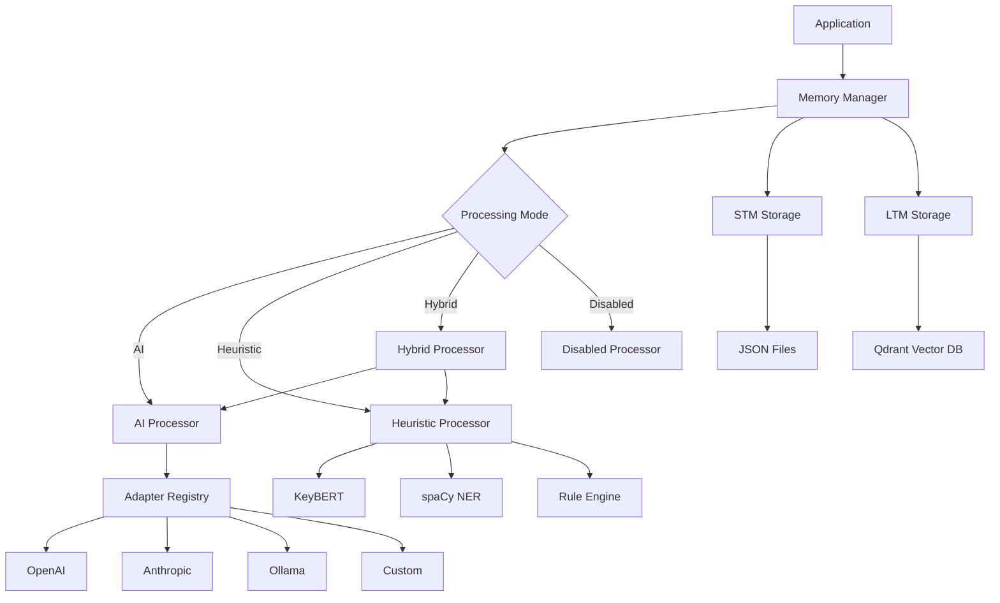
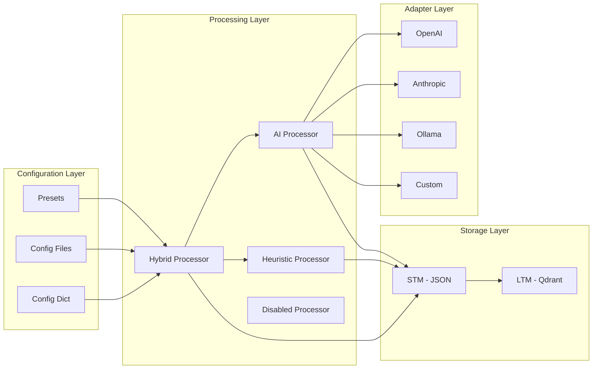
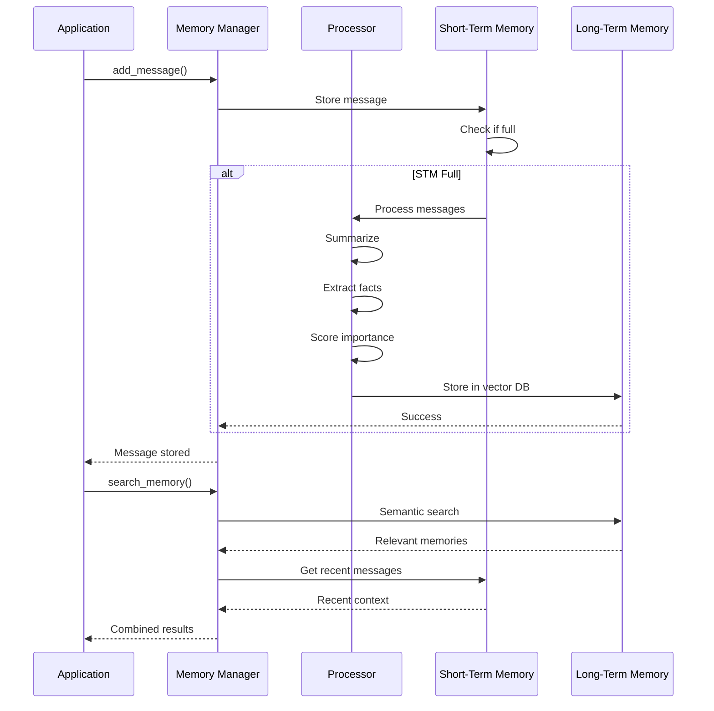

<div align="center">

# 🧠 Memory-Arc

### *Intelligent Memory Management for AI Applications*

A flexible, production-ready conversational memory engine that brings context and continuity to your AI applications. Supports multiple processing modes with pluggable adapters and zero-dependency operation.

[](https://www.python.org/downloads/)
[](https://github.com/Itachi-1824/Memory-Arc/blob/main/LICENSE)
[](https://github.com/Itachi-1824/Memory-Arc/stargazers)
[](https://github.com/Itachi-1824/Memory-Arc/issues)
[](https://github.com/Itachi-1824/Memory-Arc/pulls)

[🚀 Quick Start](#-quick-start) • [📖 Documentation](#-table-of-contents) • [💡 Examples](#-examples) • [🤝 Contributing](#-contributing)

---

</div>

## ✨ Why Memory-Arc?

<table>
<tr>
<td width="50%">

### 🎯 **Smart & Flexible**
- 🔄 **4 Processing Modes**: AI, Heuristic, Hybrid, Disabled
- 🔌 **Pluggable Adapters**: OpenAI, Anthropic, Ollama, HuggingFace
- 🎨 **Built-in Presets**: Chatbot, Coding Agent, Assistant, Offline
- ⚡ **Zero Dependencies**: Works offline without AI

</td>
<td width="50%">

### 💰 **Cost Optimized**
- 💵 **Hybrid Mode**: Smart AI/heuristic switching
- 📊 **Comprehensive Metrics**: Track usage and costs
- 🔄 **Caching**: Reduce redundant API calls
- ⏱️ **Rate Limiting**: Control API usage

</td>
</tr>
<tr>
<td width="50%">

### 🚀 **Production Ready**
- 🛡️ **Graceful Fallbacks**: Never fails on AI errors
- 📝 **Type Safe**: Full type hints
- ⚡ **Async First**: Non-blocking operations
- 🧪 **Well Tested**: Comprehensive test suite

</td>
<td width="50%">

### 🌐 **Platform Agnostic**
- 🔧 **No Framework Lock-in**: Use with any framework
- 📦 **Easy Integration**: Simple API
- 🎛️ **Highly Configurable**: JSON/YAML configs
- 📚 **Rich Documentation**: Examples & guides

</td>
</tr>
</table>

---

## 📋 Table of Contents

<details>
<summary>Click to expand navigation</summary>

- [✨ Why Memory-Arc?](#-why-memory-arc)
- [🚀 Quick Start](#-quick-start)
- [📦 Installation](#-installation)
- [🏗️ Architecture](#️-architecture)
- [🔧 Processing Modes](#-processing-modes)
- [⚙️ Configuration](#️-configuration)
- [🔌 AI Adapters](#-ai-adapters)
- [🎨 Presets](#-presets)
- [💡 Examples](#-examples)
- [📖 API Reference](#-api-reference)
- [⚡ Performance](#-performance)
- [🧪 Testing](#-testing)
- [🤝 Contributing](#-contributing)
- [📄 License](#-license)

</details>

---

## 🚀 Quick Start

### 🎯 Basic Usage (No AI Required)

```python
import asyncio
from config import MemoryConfig
from core.memory_manager import MemoryManager

async def main():
    # Create configuration (heuristic mode - no AI needed)
    config = MemoryConfig(
        mode="heuristic",
        stm_max_length=100,
        storage_path="./data"
    )
    
    # Initialize memory manager
    memory = MemoryManager(
        context_id="user_123",
        config=config
    )
    
    # Add messages
    await memory.add_message("thread_1", "user", "Hello! My name is Alice.")
    await memory.add_message("thread_1", "assistant", "Hi Alice! Nice to meet you.")
    
    # Search memory
    results = await memory.search_memory("Alice", top_k=5)
    print(results)

asyncio.run(main())
```

### 🎨 Using Presets

```python
from config import MemoryConfig
from core.memory_manager import MemoryManager

# Use a preset configuration
config = MemoryConfig.from_preset("chatbot")

memory = MemoryManager(context_id="user_123", config=config)
```

### 🤖 With AI (OpenAI)

```python
config = MemoryConfig(
    mode="ai",
    ai_adapter_name="openai",
    ai_adapter_config={
        "api_key": "sk-...",
        "model": "gpt-4o-mini"
    }
)

memory = MemoryManager(context_id="user_123", config=config)
```

> 💡 **New to Memory-Arc?** Check out our [Quick Start Guide](QUICKSTART.md) for a detailed walkthrough!

---

## 📦 Installation

<details open>
<summary><b>🚀 Quick Install</b></summary>

```bash
# Clone the repository
git clone https://github.com/Itachi-1824/Memory-Arc.git
cd Memory-Arc

# Install core dependencies
pip install -r requirements.txt
```

</details>

<details>
<summary><b>🔧 Development Install</b></summary>

```bash
# Clone and install in development mode
git clone https://github.com/Itachi-1824/Memory-Arc.git
cd Memory-Arc

# Install with dev dependencies
pip install -r requirements-dev.txt

# Or install as editable package
pip install -e ".[dev]"
```

</details>

<details>
<summary><b>📦 Optional Dependencies</b></summary>

```bash
# For AI adapters
pip install openai anthropic ollama huggingface-hub

# For enhanced heuristics
pip install keybert spacy
python -m spacy download en_core_web_sm

# Install all optional dependencies
pip install -e ".[all]"
```

</details>

### 📋 Requirements

| Component | Version | Purpose |
|-----------|---------|---------|
| **Core** | | |
| Python | 3.8+ | Runtime |
| qdrant-client | 1.7.0+ | Vector storage |
| sentence-transformers | 2.2.0+ | Embeddings |
| pyyaml | 6.0.0+ | Config files |
| python-dotenv | 1.0.0+ | Environment variables |
| **Optional** | | |
| openai | 1.0.0+ | OpenAI adapter |
| anthropic | 0.18.0+ | Anthropic adapter |
| ollama | 0.1.0+ | Ollama adapter |
| huggingface-hub | 0.20.0+ | HuggingFace adapter |
| keybert | 0.8.0+ | Enhanced heuristics |
| spacy | 3.7.0+ | NER extraction |

---

## 🏗️ Architecture

### High-Level Overview



### Component Architecture



### Data Flow



> 📚 **Want to dive deeper?** Check out [PROJECT_STRUCTURE.md](PROJECT_STRUCTURE.md) for detailed architecture documentation.

---

## 🔧 Processing Modes

Memory-Arc supports four processing modes, each optimized for different use cases:

### 1. 🎯 Heuristic Mode (Default)

Fast, offline processing using rule-based algorithms. **No AI required.**

```python
config = MemoryConfig(
    mode="heuristic",
    heuristic_config=HeuristicConfig(
        summary_method="keybert",  # or "sample", "concat"
        fact_extraction_method="keywords",  # or "ner", "patterns"
        importance_rules={
            "base_score": 5,
            "keyword_bonus": {
                "keywords": ["important", "remember", "critical"],
                "bonus": 3
            }
        }
    )
)
```

<details>
<summary>View Pros & Cons</summary>

**Pros:**
- ✅ No API costs
- ✅ Fast processing (~100-200ms)
- ✅ Works offline
- ✅ Predictable behavior

**Cons:**
- ❌ Less accurate than AI
- ❌ Limited context understanding

</details>

### 2. 🤖 AI Mode

Uses AI adapters for high-quality processing.

```python
config = MemoryConfig(
    mode="ai",
    ai_adapter_name="openai",
    ai_adapter_config={
        "api_key": "sk-...",
        "model": "gpt-4o-mini"
    }
)
```

<details>
<summary>View Pros & Cons</summary>

**Pros:**
- ✅ High-quality summaries
- ✅ Better fact extraction
- ✅ Context-aware importance scoring

**Cons:**
- ❌ API costs
- ❌ Slower (~1-3s per operation)
- ❌ Requires internet connection

</details>

### 3. ⚡ Hybrid Mode (Recommended)

Intelligently switches between AI and heuristics based on importance and probability.

```python
config = MemoryConfig(
    mode="hybrid",
    ai_adapter_name="openai",
    ai_adapter_config={"api_key": "sk-..."},
    hybrid_config=HybridConfig(
        ai_threshold_importance=7,  # Use AI for importance >= 7
        ai_probability=0.1,  # Use AI for 10% of messages randomly
        fallback_to_heuristic=True  # Fall back on AI failure
    )
)
```

<details>
<summary>View Benefits</summary>

**Benefits:**
- ✅ Balances quality and cost
- ✅ Optimizes AI usage
- ✅ Fallback on failures
- ✅ Configurable thresholds

**Use Cases:**
- Production chatbots
- Cost-sensitive applications
- High-volume systems

</details>

### 4. 🚫 Disabled Mode

Stores messages without processing. Useful for debugging or when processing is handled externally.

```python
config = MemoryConfig(mode="disabled")
```

> 💡 **Choosing a mode?** Use **Hybrid** for production, **Heuristic** for development, **AI** for maximum quality.

---

## ⚙️ Configuration

### Configuration Options

```python
@dataclass
class MemoryConfig:
    # Processing mode
    mode: Literal["ai", "heuristic", "hybrid", "disabled"] = "heuristic"
    
    # STM settings
    stm_max_length: int = 150
    storage_path: str = "./data"
    
    # LTM settings
    ltm_enabled: bool = True
    vector_db_path: str = "./data/vector_db"
    embedding_model: str = "all-MiniLM-L6-v2"
    
    # AI adapter settings
    ai_adapter_name: str | None = None
    ai_adapter_config: dict[str, Any] = field(default_factory=dict)
    
    # Heuristic settings
    heuristic_config: HeuristicConfig = field(default_factory=HeuristicConfig)
    
    # Hybrid settings
    hybrid_config: HybridConfig = field(default_factory=HybridConfig)
    
    # Performance settings
    batch_processing: bool = False
    cache_summaries: bool = True
    max_api_calls_per_minute: int | None = None
    
    # Logging and metrics
    enable_metrics: bool = True
    log_level: str = "INFO"
```

### Loading from File

<details>
<summary>JSON Configuration</summary>

```json
{
  "mode": "hybrid",
  "stm_max_length": 100,
  "ai_adapter_name": "openai",
  "ai_adapter_config": {
    "model": "gpt-4o-mini"
  },
  "hybrid_config": {
    "ai_threshold_importance": 8,
    "ai_probability": 0.05
  }
}
```

```python
config = MemoryConfig.from_file("config.json")
```

</details>

<details>
<summary>YAML Configuration</summary>

```yaml
mode: hybrid
stm_max_length: 100
ai_adapter_name: openai
ai_adapter_config:
  model: gpt-4o-mini
hybrid_config:
  ai_threshold_importance: 8
  ai_probability: 0.05
```

```python
config = MemoryConfig.from_file("config.yaml")
```

</details>

### Validation

```python
config = MemoryConfig(mode="ai")
errors = config.validate()

if errors:
    for error in errors:
        print(f"❌ Error: {error}")
else:
    print("✅ Configuration is valid!")
```

---

## 🎯 Embedding Models

Memory-Arc supports multiple embedding models for semantic search, with automatic downloads on first use.

### Available Models

<table>
<tr>
<td width="33%">

#### ⚡ Default (Included)

**all-MiniLM-L6-v2**

- Size: ~80MB
- Dimensions: 384
- Speed: Fast
- Use: General purpose

```python
embedding_model="all-MiniLM-L6-v2"
```

✅ Included with installation

</td>
<td width="33%">

#### 🎯 Enhanced Quality

**BAAI/bge-m3**

- Size: ~2.2GB
- Dimensions: 1024
- Speed: Medium
- Use: Better accuracy

```python
embedding_model="BAAI/bge-m3"
```

📥 Downloads on first use

</td>
<td width="33%">

#### 💻 Code Optimized

**jina-embeddings-v2-base-code**

- Size: ~500MB
- Dimensions: 768
- Speed: Medium
- Use: Code & technical

```python
embedding_model="jinaai/jina-embeddings-v2-base-code"
```

📥 Downloads on first use

</td>
</tr>
</table>

### Using Embedding Models

<details>
<summary><b>With Configuration</b></summary>

```python
# Default model (fast, included)
config = MemoryConfig(
    mode="heuristic",
    embedding_model="all-MiniLM-L6-v2"
)

# Enhanced model (better quality)
config = MemoryConfig(
    mode="heuristic",
    embedding_model="BAAI/bge-m3"
)

# Code model (optimized for code)
config = MemoryConfig(
    mode="heuristic",
    embedding_model="jinaai/jina-embeddings-v2-base-code"
)

# Any HuggingFace model
config = MemoryConfig(
    mode="heuristic",
    embedding_model="your-custom-model"
)
```

</details>

<details>
<summary><b>With Presets (Automatic)</b></summary>

Presets automatically use the best model for each use case:

```python
# Chatbot with default model (fast)
config = MemoryConfig.from_preset("chatbot")
# Uses: all-MiniLM-L6-v2

# Chatbot with enhanced model (better quality)
config = MemoryConfig.from_preset("chatbot-enhanced")
# Uses: BAAI/bge-m3

# Coding agent with code model (optimized)
config = MemoryConfig.from_preset("coding-agent")
# Uses: jinaai/jina-embeddings-v2-base-code

# Coding agent enhanced (AI + code model)
config = MemoryConfig.from_preset("coding-agent-enhanced")
# Uses: jinaai/jina-embeddings-v2-base-code
```

</details>

<details>
<summary><b>Model Management</b></summary>

```bash
# List available models
python -m utils.model_manager list

# Check model info
python -m utils.model_manager info BAAI/bge-m3

# Pre-download a model
python -m utils.model_manager download BAAI/bge-m3
```

```python
# Check if model is downloaded
from utils.model_manager import EmbeddingModelManager

is_downloaded = EmbeddingModelManager.check_model_downloaded("BAAI/bge-m3")
print(f"Model downloaded: {is_downloaded}")

# Get model information
info = EmbeddingModelManager.get_model_info("BAAI/bge-m3")
print(f"Size: {info['size']}, Dimensions: {info['dimensions']}")
```

</details>

### Model Selection Guide

| Use Case | Recommended Model | Preset |
|----------|------------------|--------|
| **General chatbot** (fast) | all-MiniLM-L6-v2 | `chatbot` |
| **High-quality chatbot** | BAAI/bge-m3 | `chatbot-enhanced` |
| **Code assistant** (fast) | jina-embeddings-v2-base-code | `coding-agent` |
| **Code assistant** (AI) | jina-embeddings-v2-base-code | `coding-agent-enhanced` |
| **Task assistant** | BAAI/bge-m3 | `assistant` |
| **Offline use** | all-MiniLM-L6-v2 | `offline` |

> 💡 **Tip:** Start with the default model, then upgrade to enhanced models if you need better accuracy!

> 📖 **Learn more:** Check out [examples/embedding_models.py](examples/embedding_models.py) for complete examples.

---

## 🔌 AI Adapters

Memory-Arc supports multiple AI providers through a pluggable adapter system.

### Built-in Adapters

<table>
<tr>
<td width="25%">

#### 🟢 OpenAI

```python
config = MemoryConfig(
    mode="ai",
    ai_adapter_name="openai",
    ai_adapter_config={
        "api_key": "sk-...",
        "model": "gpt-4o-mini"
    }
)
```

</td>
<td width="25%">

#### 🟣 Anthropic

```python
config = MemoryConfig(
    mode="ai",
    ai_adapter_name="anthropic",
    ai_adapter_config={
        "api_key": "sk-ant-...",
        "model": "claude-3-haiku"
    }
)
```

</td>
<td width="25%">

#### 🦙 Ollama

```python
config = MemoryConfig(
    mode="ai",
    ai_adapter_name="ollama",
    ai_adapter_config={
        "model": "llama3.2:1b",
        "base_url": "http://localhost:11434"
    }
)
```

</td>
<td width="25%">

#### 🤗 HuggingFace

```python
config = MemoryConfig(
    mode="ai",
    ai_adapter_name="huggingface",
    ai_adapter_config={
        "model": "meta-llama/Llama-2-7b",
        "api_key": "hf_..."
    }
)
```

</td>
</tr>
</table>

### Custom Adapters

Create your own adapter by implementing the `AIAdapter` interface:

```python
from adapters.ai_adapter import AIAdapter
from adapters.registry import AdapterRegistry

class MyCustomAdapter(AIAdapter):
    def __init__(self, **kwargs):
        # Initialize your adapter
        pass
    
    async def summarize_conversation(self, messages: list[dict]) -> str | None:
        # Implement summarization
        pass
    
    async def extract_facts(self, messages: list[dict]) -> list[dict]:
        # Implement fact extraction
        pass
    
    async def score_importance(self, text: str) -> int:
        # Return importance score (1-10)
        pass

# Register the adapter
AdapterRegistry.register("my_adapter", MyCustomAdapter)

# Use it
config = MemoryConfig(
    mode="ai",
    ai_adapter_name="my_adapter",
    ai_adapter_config={"custom_param": "value"}
)
```

> 📖 **Learn more:** Check out [examples/custom_adapter.py](examples/custom_adapter.py) for complete examples.

---

## 🎨 Presets

Pre-configured setups for common use cases. Just plug and play!

<table>
<tr>
<td width="50%">

### 💬 Chatbot

Optimized for conversational AI with user preferences.

```python
config = MemoryConfig.from_preset("chatbot")
```

**Configuration:**
- Mode: Hybrid
- STM: 100 messages
- AI threshold: 8 (high importance)
- AI probability: 5%
- Focus: User preferences, important statements

</td>
<td width="50%">

### 💻 Coding Agent

Optimized for code-focused applications.

```python
config = MemoryConfig.from_preset("coding-agent")
```

**Configuration:**
- Mode: Heuristic (fast, offline)
- STM: 200 messages (more context)
- Focus: Code blocks, function definitions
- Custom patterns for code detection

</td>
</tr>
<tr>
<td width="50%">

### 🤖 Assistant

Optimized for task-oriented assistants.

```python
config = MemoryConfig.from_preset("assistant")
```

**Configuration:**
- Mode: AI
- Adapter: OpenAI GPT-4o-mini
- Focus: Tasks, todos, schedules, deadlines

</td>
<td width="50%">

### 📴 Offline

Completely offline operation.

```python
config = MemoryConfig.from_preset("offline")
```

**Configuration:**
- Mode: Heuristic
- Method: KeyBERT (no external APIs)
- Works without internet connection

</td>
</tr>
</table>

### Overriding Presets

```python
config = MemoryConfig.from_preset(
    "chatbot",
    stm_max_length=200,  # Override
    mode="ai",  # Override
    storage_path="./custom_data"  # Override
)
```

> 💡 **Pro tip:** Start with a preset and customize as needed!

---

## 💡 Examples

We provide comprehensive examples to get you started quickly:

| Example | Description | Link |
|---------|-------------|------|
| 🎯 **Basic Config** | Simple heuristic mode without AI | [basic_config.py](examples/basic_config.py) |
| 🎨 **Presets** | All preset configurations | [presets.py](examples/presets.py) |
| 🔌 **AI Adapters** | OpenAI, Ollama, custom adapters | [ai_adapters.py](examples/ai_adapters.py) |
| ⚡ **Hybrid Mode** | Intelligent AI/heuristic switching | [hybrid_mode.py](examples/hybrid_mode.py) |
| 🛠️ **Custom Adapter** | Create your own adapter | [custom_adapter.py](examples/custom_adapter.py) |
| 🎯 **Embedding Models** | Different embedding models & presets | [embedding_models.py](examples/embedding_models.py) |

### Running Examples

```bash
cd examples

# Run basic configuration example
python basic_config.py

# Run all preset examples
python presets.py

# Run AI adapter examples
python ai_adapters.py

# Run hybrid mode example
python hybrid_mode.py

# Run custom adapter example
python custom_adapter.py
```

> 📚 **New to Memory-Arc?** Start with [QUICKSTART.md](QUICKSTART.md) for a guided tour!

---

## 📖 API Reference

### MemoryManager

Main interface for memory operations.

#### Constructor

```python
MemoryManager(
    context_id: str,
    config: MemoryConfig | None = None,
    storage_path: str | None = None,  # Backward compatibility
    max_stm_length: int | None = None,  # Backward compatibility
    ai_adapter: AIAdapter | None = None,  # Backward compatibility
    vector_memory: VectorMemoryManager | None = None
)
```

#### Methods

```python
# Add a message to memory
await memory.add_message(
    thread_id: str,
    role: str,
    content: str,
    metadata: dict | None = None
)

# Search memory
results = await memory.search_memory(
    query: str,
    top_k: int = 5,
    thread_id: str | None = None
)

# Get recent messages
messages = memory.get_recent_messages(
    thread_id: str,
    limit: int = 10
)

# Get metrics
metrics = memory.get_metrics()

# Reset memory
await memory.reset_memory(thread_id: str | None = None)
```

### MemoryConfig

Configuration class for memory system.

#### Class Methods

```python
# Create from preset
config = MemoryConfig.from_preset(
    preset: str,
    **overrides
)

# Load from file
config = MemoryConfig.from_file(path: str)

# Validate configuration
errors = config.validate()
```

### AdapterRegistry

Registry for AI adapters.

#### Methods

```python
# Register custom adapter
AdapterRegistry.register(name: str, adapter_class: type[AIAdapter])

# Get adapter instance
adapter = AdapterRegistry.get(name: str, config: dict)

# List available adapters
adapters = AdapterRegistry.list()

# Get adapter info
info = AdapterRegistry.describe(name: str)
```

---

## ⚡ Performance

### Benchmarks

| Operation | Heuristic Mode | AI Mode (GPT-4o-mini) | Hybrid Mode |
|-----------|----------------|----------------------|-------------|
| Summarization | ~50-100ms | ~1-3s | ~100ms-3s |
| Fact Extraction | ~20-50ms | ~1-3s | ~50ms-3s |
| Importance Scoring | <1ms | ~0.5-1s | <1ms-1s |
| Memory Search | ~10-50ms | ~10-50ms | ~10-50ms |

### Memory Usage

| Component | Memory Usage |
|-----------|-------------|
| Base System | ~50MB |
| KeyBERT Model | +50MB |
| spaCy Model | +500MB |
| Sentence Transformers | +100MB |

### Optimization Tips

```python
config = MemoryConfig(
    mode="hybrid",
    cache_summaries=True,  # ✅ Enable caching
    max_api_calls_per_minute=60,  # ✅ Rate limiting
    batch_processing=True,  # ✅ Batch operations
    stm_max_length=200  # ✅ Larger STM = fewer LTM ops
)
```

**Best Practices:**
1. 🎯 Use **Hybrid Mode** to balance quality and cost
2. 💾 Enable **caching** to reduce redundant API calls
3. 📏 Adjust **STM size** based on your use case
4. ⏱️ Set **rate limits** to prevent API quota exhaustion
5. 📦 Use **batch processing** for multiple memories

---

## 🧪 Testing

### Run Tests

```bash
# Run all tests
pytest

# Run specific test file
pytest tests/test_config_simple.py

# Run with coverage
pytest --cov=. --cov-report=html

# Verbose output
pytest -v
```

### Test Structure

```
tests/
├── test_config_*.py       # Configuration tests
├── test_processor_*.py    # Processor tests
├── test_memory_*.py       # Memory manager tests
└── test_cost_*.py         # Cost tracking tests
```

---

## 🤝 Contributing

We love contributions! Whether it's bug fixes, new features, or documentation improvements.

### 🤖 AI-Powered Workflows

Memory-Arc uses AI to help with contributions:

- **🎉 Welcome Bot**: Greets first-time contributors
- **🔍 AI Code Review**: Automated PR reviews with suggestions
- **🧪 Test Summary**: AI-generated test result summaries
- **📊 Quality Check**: Code quality analysis and recommendations
- **💬 Issue Assistant**: Helps analyze and categorize issues

### Quick Start

```bash
# Fork and clone
git clone https://github.com/Itachi-1824/Memory-Arc.git
cd Memory-Arc

# Create a branch
git checkout -b feature/amazing-feature

# Make your changes and test
pytest

# Format code
black .
isort .

# Commit and push
git commit -m "feat: add amazing feature"
git push origin feature/amazing-feature
```

When you open a PR, our AI assistant will:
- ✅ Review your code automatically
- ✅ Run tests and provide summaries
- ✅ Check code quality
- ✅ Welcome you if it's your first contribution!

### Contribution Areas

- 🔌 **AI Adapters**: Add support for new AI providers
- 🎯 **Heuristics**: Improve rule-based processing
- 📚 **Documentation**: Enhance guides and examples
- 🐛 **Bug Fixes**: Fix issues and improve stability
- ✨ **Features**: Propose and implement new features

> 📖 **Read more:** Check out [CONTRIBUTING.md](CONTRIBUTING.md) for detailed guidelines.

---

## 📄 License

This project is licensed under the Apache License 2.0 - see the [LICENSE](LICENSE) file for details.

```
Copyright 2025 Itachi-1824

Licensed under the Apache License, Version 2.0 (the "License");
you may not use this file except in compliance with the License.
You may obtain a copy of the License at

    http://www.apache.org/licenses/LICENSE-2.0

Unless required by applicable law or agreed to in writing, software
distributed under the License is distributed on an "AS IS" BASIS,
WITHOUT WARRANTIES OR CONDITIONS OF ANY KIND, either express or implied.
See the License for the specific language governing permissions and
limitations under the License.
```

---

## 🙏 Acknowledgments

- Built on top of [Qdrant](https://qdrant.tech/) for vector storage
- Uses [sentence-transformers](https://www.sbert.net/) for embeddings
- Inspired by conversational AI memory systems

---

## 🗺️ Roadmap

- [ ] 🌊 Streaming support for real-time updates
- [ ] 🖼️ Multi-modal memory (images, audio)
- [ ] 🗜️ Memory compression strategies
- [ ] 📊 Analytics dashboard
- [ ] 🧪 A/B testing framework
- [ ] 🎯 Auto-tuning based on usage patterns
- [ ] 🔌 Additional vector DB backends (Pinecone, Weaviate)
- [ ] 📤 Memory export/import functionality

---

## 📞 Support & Community

<div align="center">

### Get Help

[](https://github.com/Itachi-1824/Memory-Arc/issues)
[](https://github.com/Itachi-1824/Memory-Arc/discussions)
[](https://github.com/Itachi-1824/Memory-Arc#readme)

### Quick Links

[🚀 Quick Start](QUICKSTART.md) • [📖 Full Docs](#-table-of-contents) • [💡 Examples](examples/) • [🤝 Contributing](CONTRIBUTING.md) • [📄 License](LICENSE)

---

<sub>Made with ❤️ by the Memory-Arc Team</sub>

**⭐ Star us on GitHub — it motivates us a lot!**

</div>
